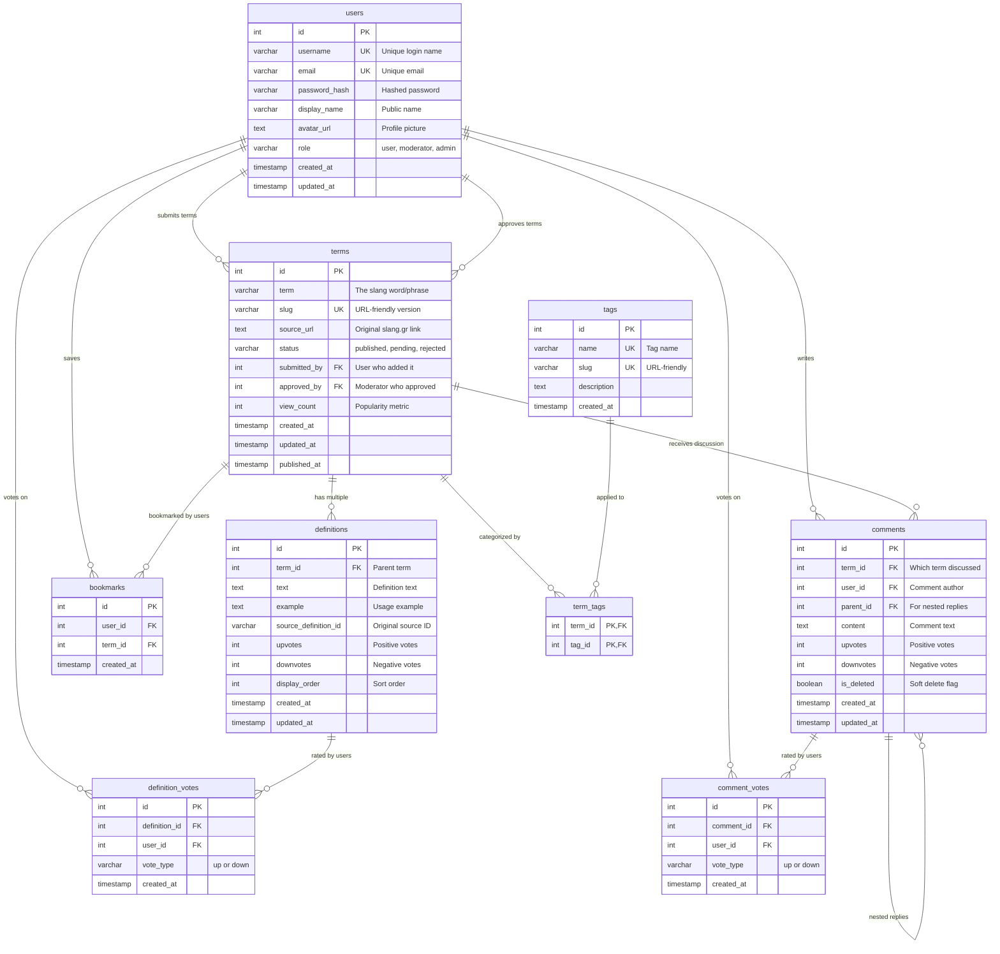

# Argko.gr Database Schema

## Entity Relationship Diagram



---

## Relationship Explanations

### Core Content Relationships

#### **users → terms (submitted_by)**

**Type:** One-to-Many  
**Reason:** Each term is submitted by one user, but users can submit multiple terms. This tracks content attribution and enables moderation workflows.

#### **users → terms (approved_by)**

**Type:** One-to-Many  
**Reason:** Each term must be approved by a moderator/admin. Users with elevated permissions can approve multiple submissions. This ensures quality control.

#### **terms → definitions**

**Type:** One-to-Many  
**Reason:** A slang term can have multiple meanings/definitions (e.g., "sick" can mean "ill" or "awesome"). Each definition belongs to exactly one term.

---

### Community Engagement Relationships

#### **users → comments**

**Type:** One-to-Many  
**Reason:** Users can write multiple comments, but each comment has one author. Enables discussion tracking and user activity history.

#### **terms → comments**

**Type:** One-to-Many  
**Reason:** Each term can have multiple comments discussing it. Comments are always about one specific term. Creates community discussion around terminology.

#### **comments → comments (self-reference)**

**Type:** One-to-Many (Parent-Child)  
**Reason:** Comments can reply to other comments, creating nested discussion threads. The `parent_id` allows unlimited nesting depth.

---

### Voting System Relationships

#### **users → definition_votes**

**Type:** One-to-Many  
**Reason:** Users can vote on multiple definitions. Each vote belongs to one user. Unique constraint prevents duplicate voting.

#### **definitions → definition_votes**

**Type:** One-to-Many  
**Reason:** Each definition can receive votes from multiple users. This enables crowdsourced quality ranking of definitions.

#### **users → comment_votes**

**Type:** One-to-Many  
**Reason:** Same principle as definition votes - users vote on multiple comments.

#### **comments → comment_votes**

**Type:** One-to-Many  
**Reason:** Comments can be upvoted/downvoted by multiple users to surface quality contributions.

---

### Categorization & Organization

#### **tags ↔ terms (via term_tags)**

**Type:** Many-to-Many  
**Reason:** Terms can belong to multiple categories (e.g., "μπρο" could be tagged as both "youth slang" and "sports"). Tags apply to multiple terms. Junction table enables flexible categorization.

#### **users → bookmarks → terms**

**Type:** Many-to-Many (via bookmarks)  
**Reason:** Users can bookmark multiple terms, and terms can be bookmarked by multiple users. The `bookmarks` table tracks personal collections.

---

## Key Design Decisions

### Cascade Deletes

- **terms → definitions, comments, bookmarks, term_tags**: Deleting a term removes all associated data
- **comments → comment_votes**: Deleting a comment removes its votes
- **definitions → definition_votes**: Deleting a definition removes its votes

### Soft Deletes

- **comments.is_deleted**: Comments aren't physically deleted to preserve conversation context. Marked as deleted but remain in database.

### Unique Constraints

- **One vote per user per item**: `(user_id, definition_id)` and `(user_id, comment_id)` prevent vote manipulation
- **One bookmark per user per term**: `(user_id, term_id)` prevents duplicates

### Indexes

- **Slugs**: Fast URL-based lookups for terms
- **Foreign Keys**: Quick joins for related data
- **Created_at timestamps**: Chronological sorting

### Status Workflow

- **terms.status**: Enables moderation queue (pending → approved/rejected)
- **submitted_by & approved_by**: Full audit trail of content lifecycle

---

## Query Patterns

### Common Queries Enabled by This Schema

1. **Get term with all definitions and comments**

   ```sql
   -- One-to-many relationships make this efficient
   SELECT * FROM terms t
   JOIN definitions d ON t.id = d.term_id
   LEFT JOIN comments c ON t.id = c.term_id
   WHERE t.slug = 'example'
   ```

2. **Get top-voted definitions**

   ```sql
   -- Aggregate votes for ranking
   SELECT d.*, COUNT(dv.id) as vote_count
   FROM definitions d
   LEFT JOIN definition_votes dv ON d.id = dv.definition_id
   WHERE dv.vote_type = 'up'
   GROUP BY d.id
   ORDER BY vote_count DESC
   ```

3. **Get user's activity (submissions, comments, bookmarks)**

   ```sql
   -- Multiple one-to-many relationships
   SELECT * FROM users u
   LEFT JOIN terms t ON u.id = t.submitted_by
   LEFT JOIN comments c ON u.id = c.user_id
   LEFT JOIN bookmarks b ON u.id = b.user_id
   WHERE u.id = 123
   ```

4. **Find terms by tag**

   ```sql
   -- Many-to-many via junction table
   SELECT t.* FROM terms t
   JOIN term_tags tt ON t.id = tt.term_id
   JOIN tags tg ON tt.tag_id = tg.id
   WHERE tg.slug = 'youth-slang'
   ```

5. **Nested comment threads**
   ```sql
   -- Self-referencing relationship
   WITH RECURSIVE comment_tree AS (
     SELECT * FROM comments WHERE parent_id IS NULL
     UNION ALL
     SELECT c.* FROM comments c
     JOIN comment_tree ct ON c.parent_id = ct.id
   )
   SELECT * FROM comment_tree WHERE term_id = 456
   ```

---

## Scalability Considerations

### Performance Optimizations

- **Indexed foreign keys**: All FK columns have indexes for fast joins
- **Denormalized vote counts**: Stored on definitions/comments for quick display
- **Display order**: Pre-sorted definitions avoid runtime ordering

### Future Enhancements

- **Partitioning**: Terms table could be partitioned by `created_at` for 1M+ rows
- **Caching**: Vote counts and view counts are prime candidates
- **Read replicas**: Separate analytics queries from transactional operations
- **Full-text search**: PostgreSQL `tsvector` for Greek text search on terms and definitions

---

## Data Integrity

### Enforced by Database

- **Foreign key constraints**: Referential integrity
- **Unique constraints**: Prevent duplicates
- **NOT NULL constraints**: Required fields
- **CASCADE actions**: Cleanup orphaned records

### Enforced by Application

- **Vote type validation**: Only "up" or "down"
- **Role-based permissions**: Only moderators approve
- **Status transitions**: Workflow validation
- **Nested comment depth**: UI limitation (not DB constraint)
